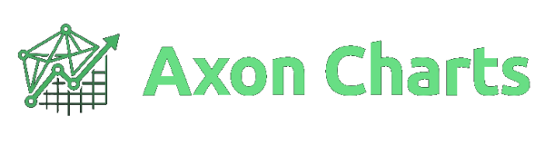
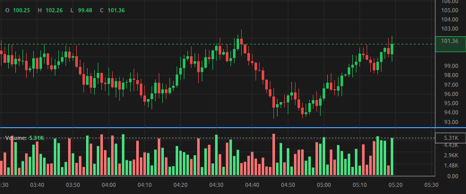

# Axon Charts

**A fast, lightweight candlestick chart library optimized for AI-driven applications and LLM integration.**

<p align="center">
  
</p>

[](LICENSE)
[](package.json)
[](dist/chart.js)

## Overview

Axon Charts is a minimal-dependency candlestick charting library for modern web applications and AI agents. Built with a focus on:

- **Performance** -- ~3ms first render, ~0.002ms tick updates, 24.9KB gzipped
- **AI-First** -- Native LLM integration with structured context export
- **Lightweight** -- Only 24.9KB gzipped (zero external dependencies)
- **Customizable** -- 91 configuration options across 14 categories
- **Type-Safe** -- Full TypeScript support with zero tsc errors

## Features

### Core Charting
- 6 series types: candlestick, bar, line, area, heiken-ashi, hollow
- Volume histogram sub-pane with independent Y-axis (ScalePane architecture)
- Real-time updates with updateLastBarFast()
- Smooth pan and zoom (mouse + touch)
- Multiple price scales (linear, logarithmic, percentage)
- Crosshair with magnetic snapping, OHLC tooltip, full-date labels
- Auto-scroll with scroll-lock detection
- Market info header + auto-scaling watermark
- Percentage mode with 0% reference line and smart formatting

### Series Types
- **Line** -- polyline connecting close prices, independent lineColor, latest price pulse animation
- **Area** -- filled polyline with gradient, close markers, latest price marker
- **Bar (OHLC)** -- open notch + high-low stem + close tick
- **Heiken-Ashi** -- smoothed candle averages, single-compute architecture, separate HA price label
- **Hollow** -- trend-colored wick/body with specific rules
- Runtime type switching via `series.type`

### LLM & AI Integration
- Structured context export (`getContext()`) with configurable data exposure
- AI agent discovery via `window.__AXON_CHARTS__` global registry
- Multi-chart support with per-chart IDs (`data-axon-charts-id`)
- Stealth mode (`context.discoverable: false`) to hide from agents
- Typed command execution (`execute()` with 9 command types)
- Event callbacks (`onCrosshairMove`, `onBarClick`, `onVisibleRangeChange`, `onDataUpdate`)
- Screenshot capture (`toDataURL`, `toBlob`)
- State serialization (`saveState`, `loadState`)
- Drawing API for persistent annotations

### Developer Experience
- 3 component APIs (priceScale, timeScale, crosshair)
- Comprehensive configuration system (91 options across 14 categories)
- Runtime option updates with validation
- Zero external dependencies

<p align="center">
  <a href="html/examples.html">
    
  </a>
  <br>
  <em><a href="html/examples.html">See live examples &rarr;</a></em>
</p>

## Installation

```bash
npm install axon-charts
```

## Quick Start

### HTML

```html
<!DOCTYPE html>
<html>
<head>
  <script src="node_modules/axon-charts/dist/chart.js"></script>
  <style>
    #chart { width: 800px; height: 400px; }
  </style>
</head>
<body>
  <div id="chart"></div>
  <script>
    const chart = AxonCharts.createChart('#chart', {
      layout: { background: '#1a1a1a', textColor: '#ffffff' },
      grid: { vertLines: { color: '#2a2a2a' }, horzLines: { color: '#2a2a2a' } }
    });

    chart.setData([
      { time: 1704067200000, open: 100, high: 110, low: 90, close: 105, volume: 15000 },
      { time: 1704070800000, open: 105, high: 115, low: 100, close: 110, volume: 22000 },
    ]);
  </script>
</body>
</html>
```

### JavaScript (ES Modules)

```javascript
import { createChart } from 'axon-charts';

const chart = createChart('#chart', { layout: { background: '#1a1a1a' } });
chart.setData(data);
```

## Try It Live

- **Live Examples:** [html/examples.html](html/examples.html) -- 11 chart configurations running live
- **Interactive Demo:** [html/demo.html](html/demo.html) -- explore all 91 settings in real-time

## Documentation

Full documentation in the [docs/](docs/INDEX.md) folder:

| Document | Covers |
|----------|--------|
| [Settings Reference](docs/SETTINGS.md) | Every configuration option with types, defaults, and status |
| [API Reference](docs/api/README.md) | Complete public API surface |
| [LLM Integration](docs/LLM.md) | How LLMs read, write, and react to the chart |
| [Streaming Guide](docs/STREAMING.md) | High-frequency tick data patterns |
| [Agent Examples](docs/EXAMPLES.md) | Integration patterns for various agent frameworks |

## API Reference

### Core Methods

```typescript
// Create chart
const chart = AxonCharts.createChart('#container', options);

// Data operations
chart.setData(bars: Bar[]): void
chart.appendBar(bar: Bar): void
chart.updateLastBar(bar: Bar): void
chart.updateLastBarFast(bar: Bar): void   // High-frequency streaming

// Lifecycle
chart.resize(width?, height?): void
chart.destroy(): void

// Get context (for AI integration)
const context = chart.getContext(): ChartContext

// Screenshot
chart.toDataURL(): string
chart.toBlob(): Promise<Blob>

// State management
chart.saveState(): ChartState
chart.loadState(state): void

// LLM command execution
chart.execute(command): void

// Drawing API
chart.addDrawing(drawing): void
chart.removeDrawing(id): void
chart.clearDrawings(): void
chart.getDrawings(): Drawing[]

// Events
chart.onCrosshairMove = fn
chart.onBarClick = fn
chart.onVisibleRangeChange = fn
chart.onDataUpdate = fn
```

### Component APIs

```typescript
chart.priceScale().setMode('logarithmic' | 'percentage')
chart.priceScale().setMargins({ top: 0.2, bottom: 0.1 })
chart.priceScale().setReverse(true)

chart.timeScale().setVisibleRange(fromTimestamp, toTimestamp)
chart.timeScale().fitContent()
chart.timeScale().zoomIn(1.5)

chart.crosshairAPI().setMode('magnet')
chart.crosshairAPI().setShowLabels(true)
```

### Configuration

```typescript
chart.setOptions({
  layout: { background: '#1a1a1a', textColor: '#ffffff', fontSize: 14 },
  grid: { show: true, vertLines: { color: '#333333' }, horzLines: { color: '#333333' } },
  series: { type: 'line', lineColor: '#FF6B35', showMarkers: true },
  crosshair: { mode: 'magnet', showLabels: true, showTooltip: true },
  volume: { show: true, heightPercent: 0.2 },
  market: { baseAsset: 'BTC', quoteAsset: 'USDT', show: true },
  watermark: { text: 'AXON CHARTS', show: true, opacity: 0.05 }
});
```

## Data Format

```typescript
interface Bar {
  time: number;      // Timestamp in milliseconds
  open: number;      // Open price
  high: number;      // High price
  low: number;       // Low price
  close: number;     // Close price
  volume?: number;   // Volume (optional, required for sub-pane)
}
```

## Performance

| Measure | Result |
|---------|--------|
| First render (5000 bars, candle + volume) | ~4ms |
| Live tick (tight loop) | ~0.001ms |
| Live tick (async 50Hz) | ~0.13ms |
| Full bar update (grid + axes) | ~0.03ms |
| Crosshair draw | ~0.02ms |
| Large dataset render (5000 bars) | ~1.4ms |
| Series type render (500 bars) | ~0.3ms |
| Bundle (gzipped) | 24.9KB |
| Memory (5000 bars) | <0.1MB |
| Bundle (gzipped) | 24.9KB |
| Memory (5000 bars) | \<0.1MB |

## Browser Support

- Chrome 90+
- Firefox 88+
- Safari 14+
- Edge 90+

## License

Apache-2.0 -- See [LICENSE](LICENSE) file for details.

## Links

- **Live Examples:** [html/examples.html](html/examples.html)
- **Interactive Demo:** [html/demo.html](html/demo.html)
- **Documentation:** [docs/INDEX.md](docs/INDEX.md)
- **Changelog:** [CHANGELOG.md](CHANGELOG.md)
- **Contributing:** [CONTRIBUTING.md](CONTRIBUTING.md)

---

**Built for the AI-driven trading community**
